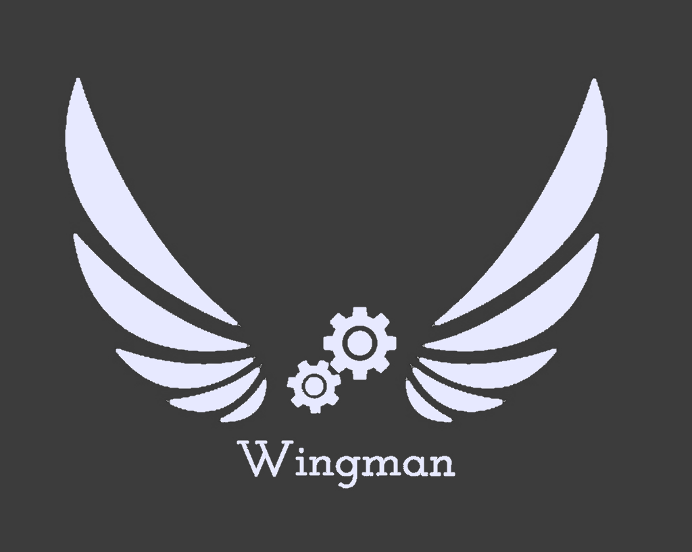

# VEX Robotics Team 36830Z - Wingman

Welcome to the official repository of VEX Robotics Team 36830Z - Wingman! This repository contains all the code for the robot and all the extra resources we use.

## About Us

We are Team 36830Z, also known as Wingman. We are from Auburn, AL and representing Auburn High School. 

## Team Members

- Drew (Author, coder, designer, team captain)
- Ian (Builder, notebooker)
- Howard (Driver, builder, notebooker)

## Table of Contents

- [Robot Design](#robot-design)
- [Programming](#programming)
- [Competition Highlights](#competition-highlights)
- [Contact Us](#contact-us)

## Robot Design

Our robot design is the result of careful planning, iterative prototyping, and attention to detail. We believe that a well-designed robot is the foundation of success in VEX competitions.

## Programming

Efficient and effective programming is what brings our robot to life. We utilize various programming techniques, including autonomous routines and driver control programs, to maximize our robot's capabilities on the field.

## Competition Highlights

We've participated in several VEX competitions, each offering valuable experiences and lessons.

## Contact Us

We love connecting with the robotics community! If you have any questions, suggestions, or just want to chat about robotics, feel free to reach out to us. You can contact me at [drew.marino01@gmail.com](mailto:drew.marino01@gmail.com).
